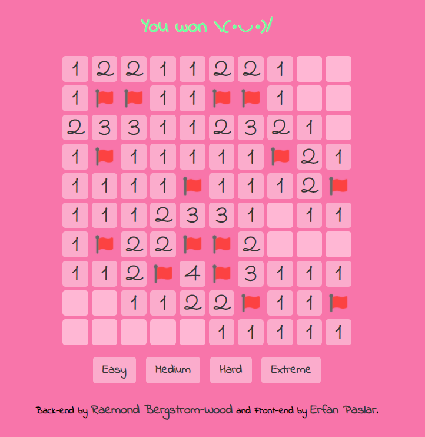

# Minesweeper-Python

The back-end was made by [Raemond Bergstrom-Wood](https://github.com/RaemondBW/Python-Minesweeper).

And I ([Erfan Paslar](https://github.com/erfanpaslar/Python-Minesweeper)) made a UI for it using [Eel](https://github.com/ChrisKnott/Eel) library.

<figure class="post-figure">

</figure>

Use `pip install eel` to install the library.

For GUI run `minesweeperGUI.py`
And for TUI run `minesweeper.py`
